# Python Intro for Data Science
This repository holds all the files seen during the CodeSpace Bootcamp for Data Science 😁

# MLFLOW

**Setup**

 - Python >= 3.9.x
 - Run Script in Docker Model section on MLFLOW IV - Kaggle II file to generate loan_predictions file to Dockerfile.
 **Note: File pkl is ignore in gitignore, but you can create in MLFLOW file in the last steps.**

    ```
    docker build -t loan-model-api .
    docker run -p 5002:5002 loan-model-api
    ```

    Try with endpoint: http://127.0.0.1:5002/invocations

**Stack**
 - Python Language
 - MLFlow library
 - Sckit-learning library
 - Kaggle platform
 
**Folder structure**

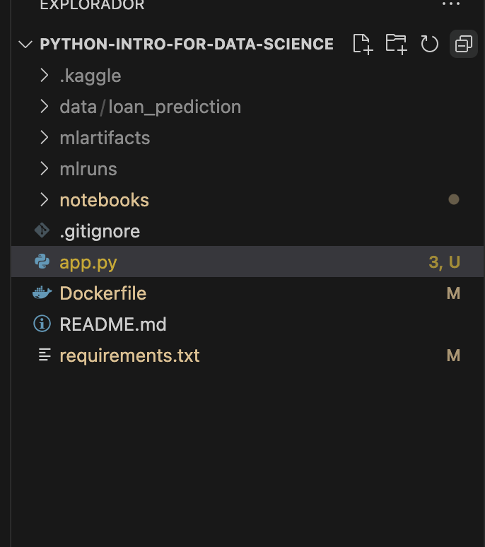

**Motivation**

The motivation behind this project is to explore and implement MLFlow for managing machine learning experiments efficiently. By leveraging MLFlow’s tracking, model registry, and logging capabilities, we aim to streamline the ML lifecycle, making model training, evaluation, and deployment more organized and reproducible. Additionally, integrating Scikit-Learn and Kaggle allows us to work with real-world datasets and enhance our model-building workflow.

**Tasks**

|                                               |
| ------------------------------------------------- |
| <input type="checkbox" disabled checked  /> Run first MLFlow server   |
| <input type="checkbox" disabled checked  /> Train first MLFlow model and autlog |
| <input type="checkbox" disabled checked  /> Train first MLFlow model and autlog |
| <input type="checkbox" disabled checked  /> Register to Kaggle competition |
| <input type="checkbox" disabled checked  /> Add Kaggle folder to project and add in gitignore |
| <input type="checkbox" disabled checked  /> Download data from Kaggle via API |
| <input type="checkbox" disabled checked  /> Submit predictions in Kaggle |
| <input type="checkbox" disabled checked  /> Answer the extra questions and try new algorithms to see different results |
| <input type="checkbox" disabled checked  /> Use xgboost to experiment |
| <input type="checkbox" disabled checked  /> Search different codes in kaggle |
| <input type="checkbox" disabled checked  /> Create Dockerfile |
| <input type="checkbox" disabled checked  /> Export model to use in dockerfile |
| <input type="checkbox" disabled checked  /> Create API with flask library to expose endpoint to use model |

# TODO

| <input type="checkbox" disabled   /> Move model export file to dockerfile from notebook. |

**Storytelling**

The notebooks are reviewed about mlflow in order to make the four notebooks, the suggested extra tasks are performed. Different training algorithms are tested.

I have had a first approach creating the first mlflow experiment and with this I have learned how to view the different sections of the mlflow ui

Mlflow server has been used to visualize the models together with their results.
In Kaggle we have also uploaded the results of the predictions in the presented challenge.
The predictive model has been dockerized to be able to expose it as an independent apii using flask to expose an endpoint.

## Images about different processes 

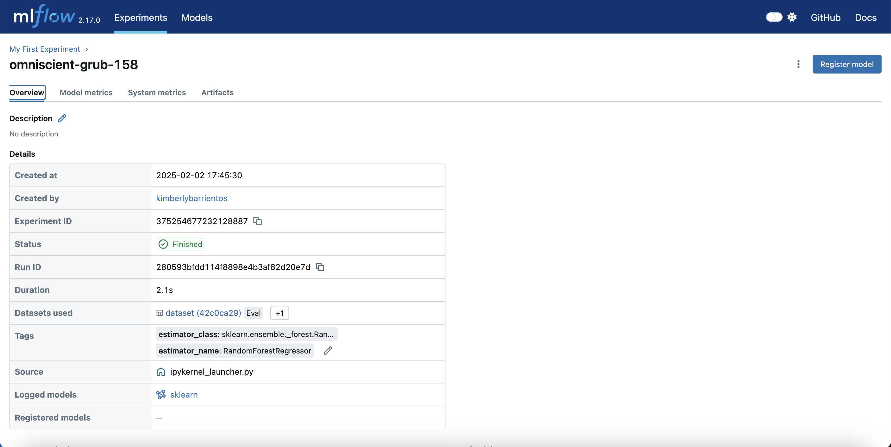
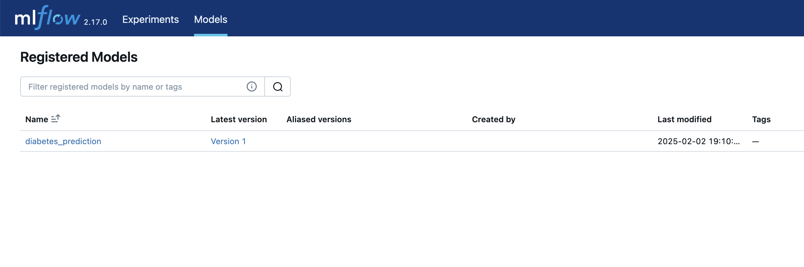
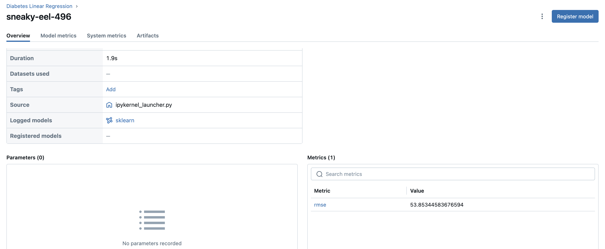
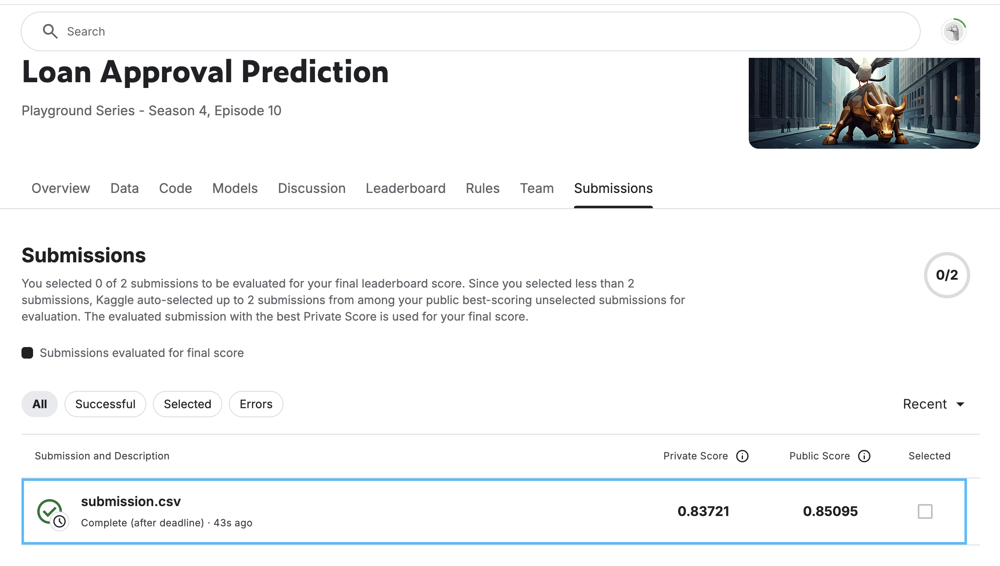
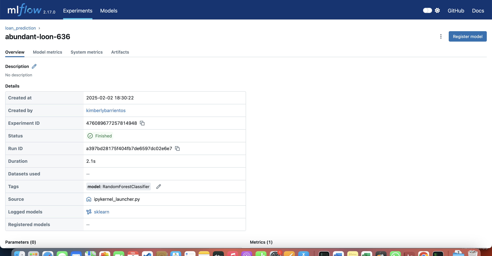
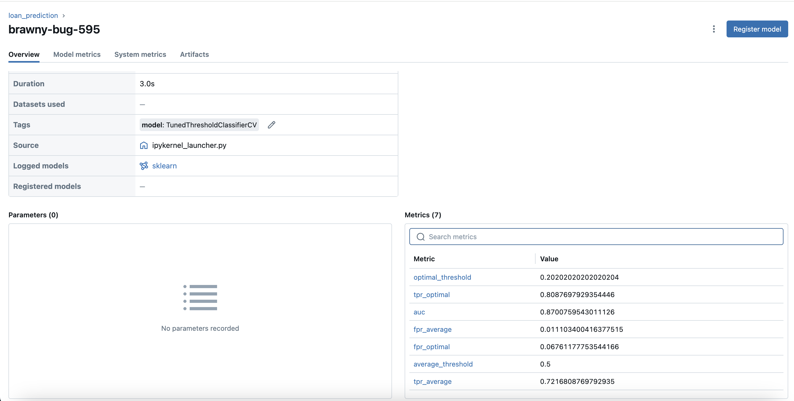
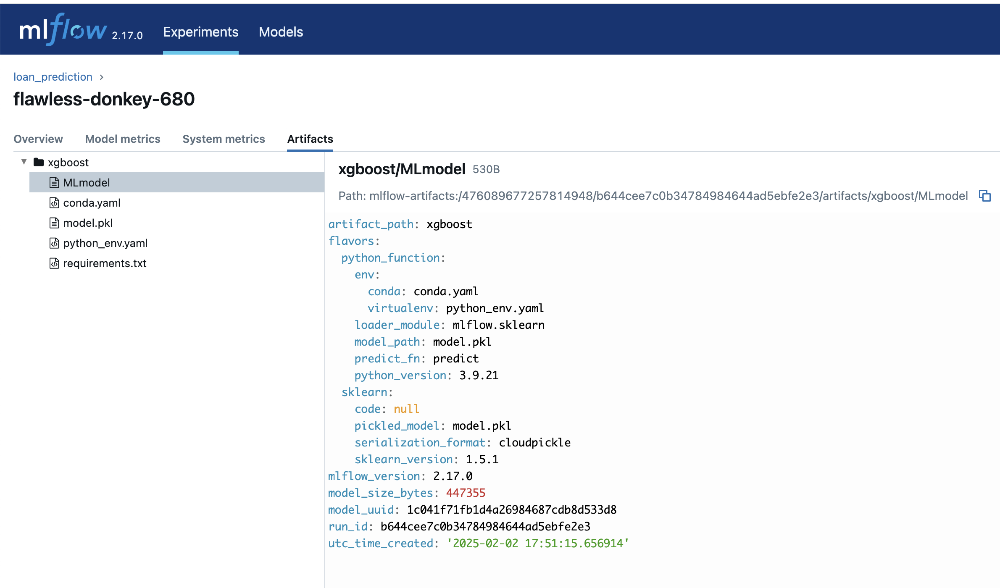
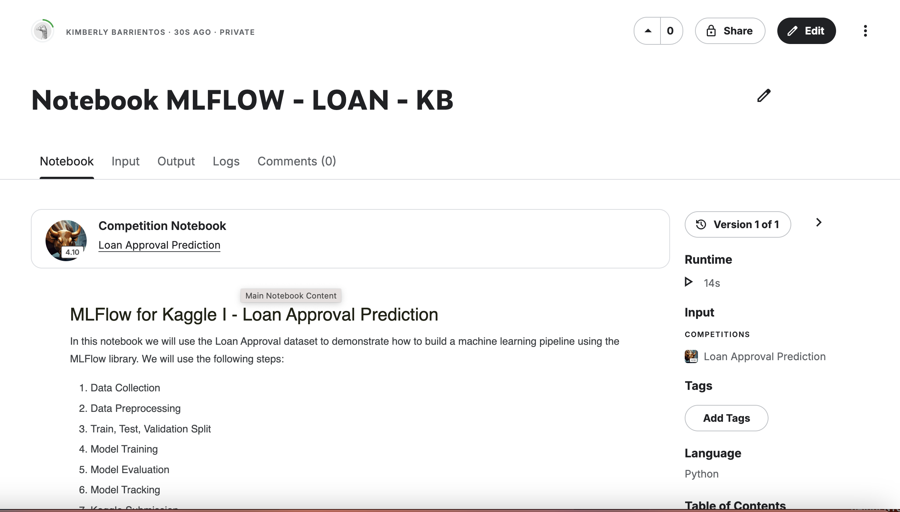
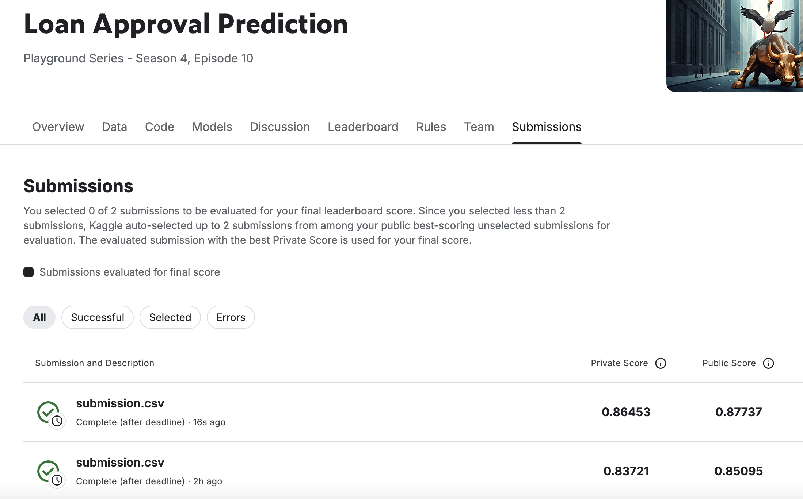
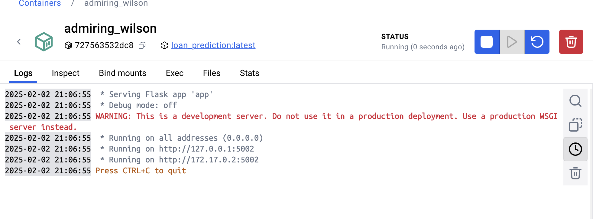
